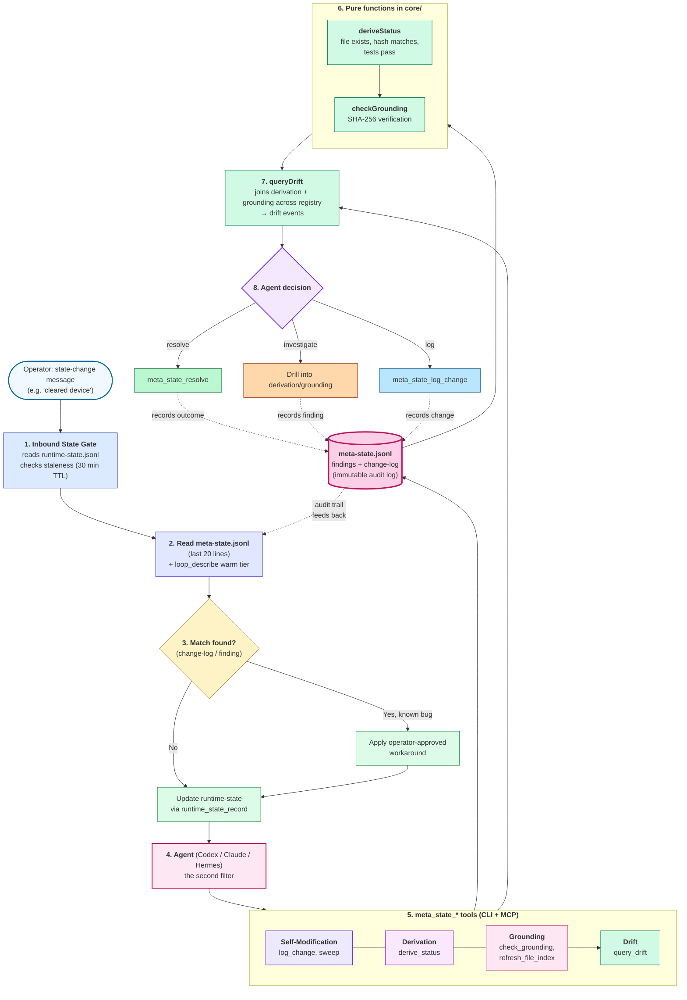

<!-- level: L3 | surface: implementation -->

# Architecture

The implementation surface companion to `docs/runtime-contract.md` (L2) and `docs/loop-engine.md` (L1). Where the contract states the 4 runtime capabilities transport-agnostically, this doc shows the mechanism that realizes them today: the 3-layer architecture, the gate system, the tool surface (the stateless CLI as primary transport plus the small MCP server residue), and the meta-state self-learning loop. The engine invariant and concept vocabulary live in `docs/loop-engine.md`; this doc names the Mastra primitives, paths, and gate modules that realize them.

## 3-Layer Architecture

The learning loop is implemented across three layers: pure core logic, a Mastra framework shell, and a runtime interface. Core has zero framework imports; the Mastra shell wraps that logic in framework primitives; the runtime interface defines the contract agent runtimes must satisfy.

```
Layer 3: Runtime Interface  (tools/learning-loop-mastra/interface/)
    |  satisfies
Layer 2: Mastra Shell       (tools/learning-loop-mastra/mastra/)
    |  wraps
Layer 1: Core               (tools/learning-loop-mastra/core/)
```

See `AGENTS.md` §1.1 for the full layer definitions and `tools/learning-loop-mastra/interface/CONTRACT.md` for the MCP-transport conformance checks.

## Constraint Gate System

The constraint gate system enforces operational boundaries on AI agent actions through a multi-layer gating architecture. It consists of inbound gates, outbound gates, and the tool surface — the stateless CLI (`tools/learning-loop-mastra/bin/loop.mjs`, primary transport for both reads and writes) plus a small MCP server residue. Constraint state that the gates read lives in `runtime-state.jsonl`, not in observation files.

### Architecture Diagram

```
Operator Message          Agent Action (Bash/Edit/Write)
       |                           |
       v                           v
[UserPromptSubmit]          [PreToolUse]
       |                           |
 inbound-state-gate        write-gate (evaluate-write-gate)
       |                    bash-coordination-gate
       |                           |
       v                           v
.last-operator-message     learning-loop-mastra tool surface
       |                    (CLI: gate_check, runtime_state_record,
       |                     meta_state_*, workflow_notify_artifact,
       |                     workflow_trigger, gate_mark_preflight, ...;
       |                     MCP residue: workflow_generate_prompt,
       |                     check_runtime_agnostic)
       |                           |
       +-----------+---------------+
                   |
              runtime-state.jsonl
              (gate state + budget tracking)
                   |
              .claude/coordination/
              workflows.json
              workflow-log.jsonl
```

### Inbound State Gate

**File:** `.claude/coordination/hooks/inbound-state-gate.cjs` (shim) → `tools/learning-loop-mastra/hooks/universal/inbound-gate.js` (universal)
**Hook Type:** `UserPromptSubmit`
**Behavior:** Soft-only (never blocks)

The inbound gate intercepts operator messages before the agent processes them. It detects state-change signals (operator reporting external state changes) and injects context reminding the agent to update observations if they are stale.

#### Flow

1. Read prompt from stdin JSON (`{ prompt: string }`)
2. Skip if prompt is empty, short (`< 10` chars), or ends with `?`
3. Detect state-change signals via regex patterns
4. Read active budget-tracking rows from `runtime-state.jsonl` (see [Runtime-State Sidecar](#runtime-state-sidecar) and `docs/runtime-contract.md` § "Runtime-state row kinds and the budget-tracking lifecycle")
5. Check staleness: `(now - updated_at) > 30 minutes`
6. If stale rows are found, write the `.last-operator-message` marker file (timestamp + prompt snippet) and inject `additionalContext` via `hookSpecificOutput`. The marker is written **only** in this branch, so a marker's existence is proof the age scan found stale state.

#### State-Change Detection Patterns

The gate uses 10 regex patterns covering:
- Device/resource clearance (`cleared`, `removed`, `wiped`, `reset`)
- Registration/creation (`registered`, `created`, `installed`, `started`)
- State reports (`working`, `running`, `fixed`, `ready`, `done`)
- Container/service state
- Slot/device status
- Operator action reports (`did`, `finished`, `completed`)
- Environment state changes
- Explicit state-change language
- Budget/resource updates
- Direct state assertions (`the X is Y`)

#### Staleness Algorithm (Inbound)

**Mode:** age — an active observation is stale when `now - updated_at` exceeds the shared observation-staleness window; a missing/invalid `updated_at` is stale (stale-on-null, so malformed state never reads as fresh). Owner: `core/observation-staleness.js#isObservationStaleByAge`; window `OBSERVATION_STALENESS_WINDOW_MS` (`core/constants.js`, 30-min default, env-overridable). The scan runs over the latest `budget-state` row per surface — the projection dedups (see Outbound Staleness) — not every raw row.

#### Output Format

When stale observations are found:
```json
{
  "hookSpecificOutput": {
    "hookEventName": "UserPromptSubmit",
    "additionalContext": "INBOUND STATE GATE: ..."
  }
}
```

Always exits with code 0 (soft gate).

### Outbound Gates

**Files (shims → universal hooks):**
- `.claude/coordination/hooks/bash-coordination-gate.cjs` (wrapper → `tools/learning-loop-mastra/hooks/universal/bash-gate.js`)
- `.claude/coordination/hooks/write-coordination-gate.cjs` (wrapper → `tools/learning-loop-mastra/hooks/universal/write-gate.js`)
**Hook Type:** `PreToolUse`
**Behavior:** Hard-blocking. A block/escalation denies the call via `hookSpecificOutput.permissionDecision: "deny"` + `permissionDecisionReason` in the stdout JSON and exits 0 — the modern PreToolUse protocol, where exit 0 is required for the harness to process the JSON and surface the reason to the model. (Exit 2 would discard the stdout JSON and fall back to stderr, surfacing a generic "No stderr output" error instead of the reason.) The rich decision (matched_rule, surface, preflight_checklist, hard_block) rides in `hookSpecificOutput.additionalContext`.

Outbound gates intercept agent tool usage before execution. Claude Code uses shim files and Hermes uses runtime-owned adapters that delegate to the same universal hook scripts in `tools/learning-loop-mastra/hooks/universal/`. Codex uses native Initial Delivery. The bash gate checks commands against constraint patterns, budgets, observation staleness, and file writes to `records/**`. The write gate enforces hard blocks on protected paths and delegates `product/**` to the preflight check.

#### Bash Coordination Gate Flow

1. Read tool input from stdin JSON
2. Skip if tool is not `Bash`
3. Match command against constraint patterns (splits on `;`, `&`, `|` — quote-aware; strips message flags and `node -e|--eval` bodies before regex matching)
4. Detect file writes to `records/**` via redirects (`>`, `>>`), heredocs (`<<`), and `tee`
5. Check resource budgets (global)
6. Check for an active budget-tracking row matching the constraint
7. Check observation staleness relative to last operator message
8. Check promoted rules from meta-state registry; skip any rule overridden via `gate_override`
9. Escalate, block, or allow
10. Append decision to per-surface `.gate-decision.log` (decision visibility)

#### Write Coordination Gate Flow

The universal write hook (`write-gate.js`) is a thin I/O adapter; all policy lives in `core/evaluate-write-gate.js`, a rule-registry cascade. The matched rule decides the outcome:

1. Read tool input from stdin JSON; normalize tool name; extract file path. Skip if not a write tool or no file path.
2. Resolve project root; compute the relative path.
3. Match the relative path against the rule registry in order:
   - `records/**` → block (use MCP tools to create/update records)
   - `runtime-state.jsonl` → block (use `runtime_state_record` MCP tool)
   - `meta-state.jsonl` → block (use `meta_state_*` MCP tools)
   - `file-index.jsonl` → block (use `meta_state_refresh_file_index` MCP tool)
   - `schemas/**` → block
   - `**/node_modules/**`, `**/dist/**`, `**/build/**` → block
   - `.loop-preflight-*` markers → block (use `gate_mark_preflight` MCP tool)
   - `product/**` → delegate to `evaluatePreflight` (preflight checklist; surface inferred from path)
   - no match → apply promoted-rules check (escalate if a promoted rule fires)
4. No matched rule and no promoted-rule escalation → allow.

`product/**` is a special case: the write gate does not hard-block it outright. It delegates to the preflight check, which verifies the operator completed the preflight checklist for that surface (see `gate_mark_preflight`). This is the seam named in `core/evaluate-write-gate.js`.

#### Staleness Algorithm (Outbound)

**Mode:** marker — an active observation is stale when the last operator-message marker is newer than its `updated_at`; a missing/invalid `updated_at` is stale (stale-on-null, matching the inbound age mode). No marker, or an invalid marker timestamp, means no state-change is pending → not stale. Owner: `core/observation-staleness.js#isObservationStaleByMarker`, called from `core/inbound-state.js#checkObservationStaleness`.

The two gates differ in *mode* (age vs marker), not in window — both use `OBSERVATION_STALENESS_WINDOW_MS` and the same reference time. The marker is the cache of "an age-staleness event occurred within the last window": the inbound gate writes it only when the age scan finds stale observations, so a marker exists only when observations were genuinely stale. See § Gate Behavior and Design Notes for the unification of the two modes.

**Projection (shared by both gates):** `readRuntimeObservations` (`core/file-readers.js`) dedups to the latest `budget-state` row per surface, so `obs.updated_at` is the authoritative per-surface-latest timestamp (this is what makes the outbound marker mode safe without re-reading the sidecar). Consequence: a surface whose latest `budget-state` row is `paused`/`stopped`/`initial` projects no active observation, so the constraint gate (`checkObservationExists` → `makeGateDecision`) **blocks** — a non-tracked surface does not satisfy the "observation required" constraint. A fresh `active` row under the canonical id (resume/restart) restores it. The inbound gate separately skips paused surfaces for staleness *warnings* (`isSurfacePaused`); the constraint-gate block is the bash-gate counterpart, not a contradiction.

### Hooks Wiring Manifest

The loop ships universal hook implementations under `tools/learning-loop-mastra/hooks/universal/`. Claude Code and Hermes wire these through two boundary patterns; Codex uses native Initial Delivery. The canonical declaration of which hook is wired how on which runtime lives in `hooks-lock.json` at the repo root (sibling of `skills-lock.json`).

**Wiring kinds:**

| Kind | What it means |
|---|---|
| `shim` | Runtime config wires a `<surface>/coordination/hooks/*.cjs` shim that `execFileSync`'s the universal hook. |
| `direct` | Runtime config wires `node tools/learning-loop-mastra/hooks/universal/<file>` directly. |
| `adapter` | Runtime config wires a runtime-local adapter (Hermes `.hermes/coordination/hooks/*.cjs` and `.hermes/hooks/loop-surface-inject.cjs`); single-source, no byte-parity mirror. |
| `none` | Runtime does not wire this hook (pull-only or not applicable). |

**Per-runtime matrix** — see `hooks-lock.json` for the source of truth (every entry carries its wiring map inline). Examples:

- `bash-gate` (PreToolUse): `.claude`=shim, `.hermes`=adapter (`matcher:"terminal"`)
- `write-gate` (PreToolUse): `.claude`=shim, `.hermes`=adapter (`matcher:"write_file|patch"`)
- `inbound-gate` (UserPromptSubmit): `.claude`=shim, `.hermes`=adapter
- `recurrence-check-on-start` (SessionStart): `.claude`=shim, `.hermes`=adapter
- `session-start-inject-discoverability` (SessionStart): `.claude`=direct, `.hermes`=adapter (`matcher:"first_turn"`)
- `session-start-inject-process-hints` (SessionStart): `.claude`=direct, `.hermes`=adapter (`matcher:"first_turn"`)

**Why multiple patterns exist:** Claude Code's PreToolUse surface uses a stable `.cjs` wrapper that the universal hook can `execFileSync`, while Hermes uses runtime-owned adapters for its native event names and payloads. The SessionStart adapter exists because context-injection is runtime-specific: Hermes has no SessionStart injection channel, so its adapter rides `pre_llm_call` gated to `is_first_turn` and carries a project-scope guard because Hermes shell hooks are global. Codex receives the initial projection through native Initial Delivery — see [Context-Injection Division of Labor](#context-injection-division-of-labor).

**Adoption path for a new hook:**

1. Implement the hook canonically in `tools/learning-loop-mastra/hooks/universal/` (ESM `.js` or CJS `.cjs`).
2. Add a `hooks-lock.json` entry with `path`, `event`, and a per-runtime `wiring` map. Decide per surface: `shim` (runtime whose config needs a CJS wrapper), `direct` (runtime whose config can call the universal hook directly), `adapter` (runtime-local SessionStart content adapter), or `none`.
3. If `shim`, mirror the `.cjs` shim byte-identical into each `kind:"shim"` surface's `coordination/hooks/` dir. The `shims-in-sync` checklist item enforces byte-identity across the manifest-declared shim surfaces only — surfaces declared `kind:"direct"`/`"adapter"`/`"none"` are filtered out.
4. Wire each runtime's `settings.json` / `hooks.json` under the entry's `event` (matcher for `PreToolUse`).
5. Run `pnpm test`. `hooks-lock-manifest.test.js` asserts every universal hook has a manifest entry; `hooks-wiring-parity.test.js` asserts each runtime's config matches the manifest's declared wiring (declared-wired IS wired; declared-`none` is NOT wired; canonical paths exist); `runtime-agnostic.test.js` (`shims-in-sync`) asserts shim byte-identity across the manifest-declared shim surfaces.

**Trust anchor:** `hooks-lock.json` is listed in `CHANGE_LOG_BOUND_PATHS` (`tools/learning-loop-mastra/core/change-log-bound-paths.js`) so future edits to the manifest trigger a `meta_state_log_change` entry — unlogged manifest edits silently redefine "correct wiring" with no meta-state trace, which the bound-path coverage closes.

### Tool Write-Authorization Layer (R2 + Path Containment)

Distinct from the bash/write gates above (which gate agent *shell commands* and tool calls), the tool surface itself carries a second write-authorization layer that gates every write a tool performs during `execute`. This layer is the single authorization point for tool writes (both the MCP server and the CLI one-shot wrap the same handler with `withR2Gate`); the bash/write gates do not see inside tool execution.

**Files:**
- `tools/learning-loop-mastra/mastra/with-r2-gate.js` — `withR2Gate` wrapper applied to every tool via `createLoopTool`
- `tools/learning-loop-mastra/bin/loop.mjs` — CLI wraps each handler with the same `withR2Gate` so the CLI executes the same code path as the MCP server
- `tools/learning-loop-mastra/core/identity-pin.js` — `pinRuntimeIdAtBoot()`, first statement of `mastra/server.js`
- `tools/learning-loop-mastra/core/path-containment.js` — `resolveSafePath` (LIM-4 realpath containment)
- `.loop/r2-allowlist.json` — per-runtime own/deny + universal ownership table

**Behavior:**
1. At server boot, `pinRuntimeIdAtBoot()` reads `process.env.LOOP_SURFACE` (set via the `env` field of each runtime's `mcp.json`), validates it against the supported surfaces, and freezes the runtime id for the process lifetime (no setter exported).
2. Each tool's `execute` is wrapped by `withR2Gate`. For every declared write path field (`pathFields` in `tools/learning-loop-mastra/tools/manifest.json`), the gate resolves the path via `resolveSafePath` and checks ownership against `.loop/r2-allowlist.json` (per-runtime own/deny plus universal entries).
3. `validateToolManifest` runs at boot and throws if any tool lacks `pathFields`, enforcing default-deny for undeclared write paths.
4. `resolveSafePath` realpath-resolves user paths and rejects traversal, symlink, and hardlink escape. It is the path-safety layer beneath the R2 gate and is also used directly at the seven audit-log/recording sites that previously used `path.join`.

Audit-log entries (`gate-decision-log.js`, `r2/denial-log.js`) assert no raw newlines and pre-resolve the recorded `path` field via realpath.

For the full gating chain, allowlist schema, and operator runbook, see `docs/security/plan-5-hardening.md`.

### Constraint Gate Tool Surface

**Files:** `tools/learning-loop-mastra/mastra/server.js` (MCP) and `tools/learning-loop-mastra/bin/loop.mjs` (CLI)
**Transports:** stdio MCP protocol and stateless CLI one-shot

The handler manifest has 44 entries (`tools/learning-loop-mastra/tools/manifest.json`). 42 of them ride the CLI as `CLI_TOOLS` (12 read `CLI_READ_TOOLS` + 30 write `CLI_WRITE_TOOLS` — see `core/cli-tools.js`, or run `LOOP_SURFACE=.claude node tools/learning-loop-mastra/bin/loop.mjs list`). The CLI is the single record surface in every runtime: Codex uses `.codex/config.toml`, Claude Code uses root `.mcp.json`, and Hermes uses `.hermes/mcp.json`; all share this contract. The MCP server keeps only the 8-tool residue — `workflow_generate_prompt`, `check_runtime_agnostic`, `update_r2_allowlist`, the two `run_workflow_storage_*` tools, and the three `ask_*` agent wrappers. All policy logic lives in `tools/learning-loop-mastra/core/` — single source of truth for all runtimes.

#### gate_check

Returns `ok`, `block`, or `escalate` for a given command. Splits on `;`, `&`, `|` (quote-aware), strips message flags and `node -e|--eval` bodies before regex matching, then checks against constraint patterns and promoted rules. Includes `inbound_gate: true` when observations are stale relative to the last operator message.

#### gate_override

Temporarily overrides a promoted I3 action-boundary Rule for the current session. The override is TTL'd (max 24h), audited in `runtime-state.jsonl`, and applies only to regex/glob Rules enforced by the bash gate. Requires a non-empty `operator_note` for the audit trail. Reads and writes the `.gate-override` marker via `readModifyWriteOnAllSurfaces` for cross-surface consistency.

#### Hook-bypass denial (registry data)

The universal bash gate denies hook-bypass commit forms (long and short bypass flags) and destructive `core.hooksPath` overrides through the active promoted rule `rule-no-verify-bypass-denied`. The rule is consumed by all runtimes through the shared shim path; an intentional operator exception is the audited `gate_override` write path, never a hook-bypass flag.

#### gate_check_recurrence

Checks the gate's decision log (`.gate-decision.log` per surface) for recurring false-positive patterns. Reads the log via `readJsonlFromAllSurfaces` for cross-surface deduplication. Groups by `rule_id` + normalized command prefix; emits a meta-state `finding` when a pattern recurs at least 3 times within 10 minutes. Threshold and window are configurable.

#### workflow_notify_artifact

Logs an artifact change to `gate-log.jsonl`, checks observation staleness, and triggers matching workflows from the workflow registry.

#### workflow_trigger

Validates a command against an allowlist and spawns it with isolated stdio. Only `node` with a script path under `tools/` is permitted.

#### check_runtime_agnostic

Audits a feature against the 6-item runtime-agnostic checklist (core-in-universal-location, shims-in-sync, protocol-adapter-i-o, manifest-registered, cross-surface-iteration, parameterized-for-new-surfaces). Returns structured feedback with fix suggestions for each failure. Use when adding a new feature to verify the shim-not-fork + cross-surface-iteration pattern. The checklist is shared between this MCP tool and `__tests__/integration/runtime-agnostic.test.js`.

### Workflow Layer

The workflow layer auto-triggers commands when artifacts change.

#### workflow_notify_artifact(path, change_type)

When an agent writes an evidence file, it calls `workflow_notify_artifact` via the tool surface. The tool:

1. Appends a structured log entry to `.claude/coordination/gate-log.jsonl`
2. Reads `.claude/coordination/workflows.json` to find matching workflows
3. Checks if the artifact path and change type match any trigger rules
4. Spawns each matching command via `workflow_trigger`

#### Workflow Registry

The workflow registry is hardcoded in `core/workflow-registry.js` (not a JSON file on disk). Each entry maps an artifact-change trigger (`triggers` globs + `change_types`) to a `recommended_tools` list:

```json
{
  "evidence-changed": {
    "triggers": ["records/*/evidence/**"],
    "change_types": ["created", "updated"],
    "recommended_tools": []
  }
}
```

`workflow_notify_artifact` evaluates the change against this registry via `evaluateTriggers` and **returns the recommended tools** — it does NOT spawn processes. The agent calls the recommended tools explicitly. `recommended_tools` is currently vacated across all entries; the field is required by the handler shape but may be empty. `workflow_trigger` looks up a workflow by name and returns its `recommended_tools` list the same way. Both handlers append a structured entry to `gate-log.jsonl` (per-surface) on each call, and `workflow_notify_artifact` requires the changed path to be under `records/**` (in-handler ownership guard, since the manifest declares `pathFields: []`).

#### Workflow Logs

- **Decision/trigger log:** per-surface `.gate-decision.log` (also written by the bash gate) and the `gate-log.jsonl` append from `workflow_notify_artifact` / `workflow_trigger`.

Workflows are synchronous tool returns, not fire-and-forget process spawns; the agent receives the recommendation in the tool result and decides what to call next.

### Log Rotation

`gate-log.jsonl` rotates at 10 MB, keeping 5 backups. Older backups are deleted automatically.

### Observation Model

Constraint state (the budget/observation rows the gates read) lives in `runtime-state.jsonl` as `budget-state` rows, not in `records/observations/` YAML (that directory is a legacy empty artifact). See [Runtime-State Sidecar](#runtime-state-sidecar) and `docs/runtime-contract.md` § "Runtime-state row kinds and the budget-tracking lifecycle" for the current row model, lifecycle, and staleness algorithm.

### Environment Variables for Testing

| Variable | Purpose |
|----------|---------|
| `GATE_ROOT` | Override project root for observation lookup |
| `GATE_MARKER_PATH` | Override path for `.last-operator-message` marker |

### Gate Behavior and Design Notes

#### Marker is written only when observations are actually stale

The inbound gate writes the `.last-operator-message` marker **after** the staleness check, not before. A marker therefore exists only when the age scan genuinely found stale observations, which is what makes the outbound gate's marker-vs-observation comparison safe — a marker is never a phantom left by a fresh-observation run.

#### One shared staleness primitive (age and marker are modes of the same window)

The inbound gate uses an age threshold (`now - updated_at > window`); the outbound gates use a marker comparison (`marker > obs.updated_at`). Both modes share one primitive — `OBSERVATION_STALENESS_WINDOW_MS` + `observationReferenceTimeMs` + stale-on-null — in `core/observation-staleness.js`, and both read the same per-surface-latest `updated_at` (the projection dedups). The mode difference is by design; the *disagreement* that two independent constants could drift is gone structurally — there is one constant in `core/constants.js`, not two that happen to match.

#### 30-minute marker TTL prevents perpetual escalation

A marker older than 30 minutes is treated as `null` by `readLastOperatorMessage`, so an operator's state-change message cannot escalate commands indefinitely. The TTL and the inbound observation-staleness window are one shared constant — `OBSERVATION_STALENESS_WINDOW_MS` (`core/constants.js`) — used by `core/inbound-state.js#isMarkerFresh` and the age predicate in `core/observation-staleness.js`, so the two cannot drift.

#### Staleness check runs for every constraint-matched command

`gate_check` runs `checkObservationStaleness` for all constraint-matched commands regardless of the gate decision — not only when the decision is `ok`. Budget escalation responses therefore include `inbound_gate: true` when observations are stale; the existing `ok → escalate` upgrade behavior is preserved.

#### Atomic marker writes

Marker files are written atomically (write to temp + rename) in `inbound-state-gate.js`. A concurrent read during a write can no longer hit a partial JSON payload that would make `readLastOperatorMessage` return `null` and silently skip the escalation.

#### Recurring false-positive detection

`gate_check_recurrence` and the `recurrence-check-on-start` SessionStart hook read `.gate-decision.log` across all surfaces, group by `rule_id` + normalized command prefix, and auto-file a `finding` when a pattern recurs N≥3 times within one session. The SessionStart hook runs the check on every session start; threshold and window are configurable. The tracker normalizes the prefix through a coarser key than the gate's blanker chain (`blankDataPayloadsForKey` in `recurrence-tracker.js`): heredoc bodies and `node -e` payloads are data to the key, so all payload variants of one root-cause class collapse to one finding. This surfaces overly-broad promoted rules or constraint patterns that match benign commands without manual operator notice.

#### Per-worktree marker isolation

The marker filename embeds a per-worktree session ID (sha256(12) prefix derived from `.git/HEAD` content, or `${pid}-${timestamp}-${randomHex}` for non-git dirs). Two worktrees in the same repo get distinct marker filenames, so session A's state-change message does not affect session B's outbound gate. Backed by `tools/learning-loop-mastra/core/worktree-session-id.js`.

#### Marker stores a prompt snippet in plaintext

The marker file stores the first 200 characters of the operator's prompt in plaintext. Sensitive information in operator messages may be persisted to disk; questions ending with `?` are already filtered to reduce noise, but further mitigation (boolean flag or hash instead of raw content) is still open.

## Runtime-State Sidecar

The runtime-state sidecar (`runtime-state.jsonl`) is the loop's short-term
memory: budgets, counters, dispatch ledger events, and delivery attestations.

**Durability split.** The L1 durability axis (`docs/loop-engine.md` § Budget tracking vs ledger log) and the L2 contract (`docs/runtime-contract.md` § Runtime-state row kinds and the budget-tracking lifecycle) distinguish durable rows — ledger logs and the budget-tracking lifecycle — from ephemeral TTL'd allowances (e.g. `gate-verb:*`), which belong to the session that minted them. The mechanism realizes that split across **two substrates**:
- **`runtime-state.jsonl`** (committed) holds the durable rows: ledger logs and the budget-tracking lifecycle. Every participating runtime reads these identically.
- **`.loop/runtime-state-local.jsonl`** (gitignored, session-local) holds ephemeral TTL'd allowance rows (`gate-verb:*`). A fresh clone loses only these session-scoped allowances — correct by contract.

The write path routes by a `durability` axis (`runtime_state_record` accepts `durability: "durable" | "ephemeral"`, default durable; the stop tool derives it from the `gate-verb:*` namespace). A **symmetric namespace guard** at the record-tool boundary enforces `gate-verb:*` ⟺ `ephemeral` — a durable `gate-verb:*` row or an ephemeral non-`gate-verb` row is rejected (`durability_namespace_mismatch`), structurally preventing a durable and an ephemeral row from ever sharing an id. The write-path version scan is **destination-scoped** (reads only the destination substrate, so per-substrate versioning is real). The read path merges both substrates: `readRuntimeObservations` / `runtime_state_read` project durable rows AND session-local ephemeral allowances from one view. A malformed line in the disposable local substrate does NOT poison durable writes; a malformed line in the committed substrate fails closed. Both substrates carry the same 3-layer write protection (bash gate + write-tool preflight delegation to `surface:'runtime-state-edit'` + R2 bootstrap deny) and the local file is gitignored.

Two maintenance contracts keep the sidecar tractable at operator scale.

### Versioned dedup (`max_by(version)` per id)

Every row carries a `version` integer. The public reader
(`runtime_state_read`) collapses to one row per id via `max_by(version)`,
ties broken by newest timestamp with `timestamp ?? ""` fallback then
last-in-file order (mirrors meta-state's `created_at ?? ""` precedent at
`core/meta-state.js:768-769`). The raw sidecar still stores every row
(history preserved; the inbound gate reads raw for its per-`affected_system`
latest-row scan). Append is wrapped in `withRegistryLock` so two
concurrent writers (e.g. CLI one-shot + a sibling runtime sharing
`GATE_ROOT`) cannot both read `max=N` and both write `version=N+1` —
without the lock, dedup silently loses writes.

`version` is a dedup bookkeeping field and is NOT part of the v2
fingerprint. Re-records already differ by `timestamp`, so fingerprints
already differ. No row migration: existing unversioned rows default to
`0` at read time.

### Budget tracking lifecycle

`runtime-state.jsonl` holds two conceptually distinct row kinds (named in `docs/loop-engine.md` § Budget tracking vs ledger log): **budget tracking** (mutable external-resource state with a tracking lifecycle) and **ledger logs** (immutable audit). The mechanism in this section governs the *budget-tracking* lifecycle. Ledger logs have no tracking lifecycle — they are history, out of the budget gate's stale-scan scope by definition (concept boundary, not an exemption the gate grants).

The tracking lifecycle is `initial → active → paused → stopped`. `pause` is the operator's statement that a budget rule no longer matters *for now* — the natural lifecycle step of external-budget management, not a suppression of noise. A paused surface's budget rows are not appended by either writer and are not surfaced by the inbound gate's stale-observation scan, so the gate and the writers agree on what gets surfaced. The scan ceasing is a consequence of *not tracking* the budget, not a filter applied to its rows.

Lifecycle state lives in-band in `runtime-state.jsonl` itself (`kind: budget-state`, `status: paused | stopped | active`, one canonical id per `affected_system` — the surface name). `runtime_state_pause` appends a `status: paused` version; `runtime_state_resume` appends `status: active` (only from `paused`); `runtime_state_stop` appends `status: stopped` (terminal for the chain; restart is a budget-state `runtime_state_record` under the same canonical id). The canonical reader is `readBudgetTrackingState(root, surface)` (`core/runtime-state.js`), which returns the latest `status` for the surface's canonical budget-state entity and throws on any unparseable sidecar line or corrupt budget-state row (writers fail closed with a structured `corrupt_state` error; read gates catch and degrade to "not paused"). `isSurfacePaused(root, surface)` reads this and returns true for `paused` or `stopped`; the inbound gate's stale-observation scan short-circuits paused surfaces on both the bash-gate path (`core/inbound-state.js`) and the UserPromptSubmit emitter path (`core/evaluate-inbound-gate.js` `loadStaleActiveObservations`).

The `kind` discriminator is load-bearing: `readRuntimeStateRowsLatest` plus the kind+status filter (kind=`budget-state`, status=`active`) is what the gate actually reads. `ledger-event` rows are out of scope by kind — emitting a drift observation for them would pollute the gate. The `unmapped-active-entry` drift check fires only for unmapped budget-state rows; ledger-event rows are out by kind, never by an exemption the gate grants.

`stop` is the non-destructive retire: appending `status: stopped` keeps the row history (each lifecycle step is a versioned row) and the operator can verify what was paused when, but the stopped chain gets no further pause/resume transitions and no ledger events under the canonical id. Restart is a deliberate budget-state `runtime_state_record` under the same canonical id — a fresh `active` version on top of the preserved history; `runtime_state_record` rejects budget-state rows under any non-canonical id, so a surface never has two tracking entities. There is no `runtime_state_prune_surface` — the "delete the ledger to clear the gate" footgun is gone structurally; the budget gate cannot be cleared by deleting the ledger.

The per-surface preflight marker (`SURFACES/coordination/.loop-preflight-runtime-tracking`) authorizes pause/resume/stop — same per-surface convention as `runtime_state_record`'s `.loop-preflight-runtime-state`, and same 30-minute TTL as `gate_mark_preflight`'s markers (a stale or content-less marker does not authorize). The deny-list rules (`core/r2/ownership.js`, `core/evaluate-bash-gate.js` `PATH_WRITE_PATTERNS`, `core/bound-artifacts.js`) remain as no-op defenses. There is no `prune` tool (see `git log --diff-filter=D` for the historical record).

## Meta-State Self-Learning Loop

The loop is self-referential: the loop's own state machine (`meta-state.jsonl`) controls the loop's own audit trail. The agent can record its own modifications, derive the effective status of any finding, ground findings against the live filesystem, and query drift between asserted and derived state across the entire registry. The concept (engine invariant, 4-kind union, lifecycle) lives in `docs/loop-engine.md` (L1) and `docs/meta-state-lifecycle.md` (L1); this section names the mechanism.

The relationship model is centralized in `tools/learning-loop-mastra/core/entry/relationship-graph.js` — the single source of truth for the cross-ref field table per kind, forward + inverse resolution, and write-time structural referential-integrity (RI) validation (id-existence only). Consumed by the 4 factories (`finding` / `rule` / `change-log` / `loop-design`), `core/loop-introspect.buildInverseIndexes`, the `meta_state_relationships` handler, the `meta_state_relationship_validate` handler, the post-merge CI validator (`scripts/validate-registry-refs.js`), and the write-time RI at `writeEntry` / `updateEntry` / `metaStateBatch` boundaries. The retrieval wire shape (`groupOutbound` / `groupInbound` / `INBOUND_KEY_MAP` + `computeDanglingRefs`) stays in the relationships tool because it needs `stale-view` and is presentation logic. The three-mechanism boundary (file-index = findings-on-a-file; typed edges = lifecycle lineage; cascade = closure policy) is documented in `docs/meta-state-lifecycle.md` § "Three-Mechanism Boundary".

### Meta-State Tools

The 22 `meta_state_*` handlers drive the self-learning loop; see `tools/learning-loop-mastra/tools/manifest.json` for the authoritative list, or run `LOOP_SURFACE=.claude node tools/learning-loop-mastra/bin/loop.mjs list` for the live CLI surface. The concept (engine invariant, 4-kind union, status transitions) lives in `docs/loop-engine.md` and `docs/meta-state-lifecycle.md`.

#### Append model

`meta-state.jsonl` is versioned-append: multiple records per id coexist on disk (a v0 `reported` row plus a later `resolved`/`superseded`/`archived` row), and the default read collapses to one row per id via `max_by(version)` (ties broken by `created_at`, then last-in-file). `change-log` rows live in a **separate** `change-log.jsonl`; the union reader is `tools/scripts/registry-table.sh`, which reads the union of `meta-state.jsonl` + `change-log.jsonl` and dedupes by id. Bypass the projection with `meta_state_list({ include_all_versions: true, include_archived: true })` or `registry-table.sh --all-versions`. Finding status has **no live TTL** — the `expires_at` field is vestigial; statuses are `reported` / `active` / `stale` / `auto-resolved` (plus terminal `resolved` / `superseded` / `archived`). See `docs/meta-state-lifecycle.md` for the transition rules.

### Self-Learning Loop Architecture



**Key properties:**

- **Self-aware audit trail**: The agent uses `meta_state_log_change` to record any system modification (schema change, tool addition, gate rule promotion, etc.) as a first-class entry. The change-log entries are immutable audit log (no TTL, no auto-resolve).
- **Verifiable assertions**: For any finding, the agent can call `meta_state_derive_status` to compute the effective status from the live filesystem (without mutating the entry). Drift between the entry's `status` and the derived `derived_status` is surfaced via `drift: true`.
- **Grounded claims**: For findings with `mechanism_check: true`, the agent can call `meta_state_check_grounding` to verify the file is still live, the SHA-256 hash matches the last check, and (optionally) the referenced tests still pass. Drift is detected via `status: "drifted"`.
- **Aggregate drift surfacing**: `meta_state_query_drift` joins derivation's `derived_status` + grounding's `grounding.status` across the entire registry, returning a flat list of drift events with `recommendation` (resolve / investigate). Default `run_grounding: false` (derivation-only); opt-in to join grounding.
- **Schema-as-source-of-truth**: The meta-state tool zod schemas are generated from JSON Schema at runtime via `core/schema-to-zod.js`, so the JSON Schema is the single source for the tool input shape. A field-coverage test catches drift between schema and tool surface.

### Relationship to the Constraint Gate

The constraint gate (`core/gate-logic.js`) and the meta-state registry are **separate** but **complementary**:

- The **gate** enforces *observation existence* (pattern matched → observation present? → pass/block). It does NOT track budget exhaustion, fingerprint matching, or other domain state. The gate is the first filter.
- The **meta-state** records the *agent's reasoning* (e.g., "I checked the budget and it was safe because the fingerprint matched"). It is the audit trail. The agent is the second filter.
- See `docs/meta-state-lifecycle.md` § Layer Separation for the full layer separation.

### References

- `docs/loop-engine.md` — the engine invariant and concept vocabulary (L1)
- `docs/runtime-contract.md` — the transport-agnostic runtime participation contract (L2)
- `docs/meta-state-lifecycle.md` — the 4-kind union, status transitions, fingerprint lifecycle, layer separation (L1)
- `docs/trajectory.md` — long-term direction, the bridges, the fifth bridge (schema as source of truth)

## Context-Injection Division of Labor

The context-injection surface is one **hint registry** consumed by two paths: production injection (builders) and inspection (renderer + CLI). The trust objection that justified an earlier LOCAL mirror ("server hint strings not trusted at render time") is dissolved by the fact that hooks already `require('../../core/loop-introspect.js')` directly. Direct core import removed the wire, the spawn, and the mirror.

The Hermes SessionStart adapter (`.hermes/hooks/loop-surface-inject.cjs`, declared `kind:"adapter"` in `hooks-lock.json`) is documented under [Hooks Wiring Manifest](#hooks-wiring-manifest), together with the universal hooks it adapts and the two retained wiring patterns. Codex receives the same startup projection through native Initial Delivery.

- **Source of truth:** `core/hint-registry.js` — slug-keyed entries `{ slug, kind, tier, text, suggestion, derived_from_rule }`. `tier` is the **injection policy** (`"startup"` | `"on-demand"`, default `"startup"`), decoupled from semantic `kind` (discoverability | process): it says *when* a hint is injected, not *what it is about*. Rule-derived process entries carry empty inline text and resolve from `rule.hint_text` at render time via the shared `resolveHintText` path.
- **Startup vs on-demand.** A small startup set (4 discoverability hints needed to prevent a wrong first action) is auto-injected full-text at warm; the remaining reference hints are **on-demand** — discoverable via `hint_index` (all slugs + one-line suggestions, always present on warm) and fetched in full via `loop_get_instruction({key})`. The `tier` filter is applied at **warm-injection sites only** (`loop-introspect` warm builders, `loop-describe` warm `buildHintBlocks`, the `.claude` universal session-start hooks, and the Hermes adapter). The cold `loop_describe` tier (full history) and the `hint-renderer` channels (inspection) stay **unfiltered** — operators can always preview every hint. `loop_get_instruction` resolves against the full registry regardless of tier. `listHints({kind, tier})` defaults `tier=undefined` (no filter) so `loop_get_instruction`'s numeric-index resolution never silently shrinks.
- **Production injection:** `core/loop-introspect.js` builders (`buildDiscoverabilityHints` / `buildProcessHints`) project the registry into the legacy array-of-strings shape, filtered to `tier:"startup"` on the warm path; `buildHintIndex` projects all slugs + suggestions (reusing the same pointer projection) so on-demand hints stay discoverable. All injection surfaces consume the builders — the hint renderer is NOT on the injection path (the builders already deliver single-source content; wiring hooks through the renderer would churn three hot paths for no behavioral gain).

Four surfaces, one registry. Every injected surface rides a declared **channel** (named in `core/hint-renderer.js#CHANNELS`); delivery fidelity is **attested** by the offline classifier, not assumed:

| Surface | Channel | Trigger | Delivery fidelity | Role |
|---|---|---|---|---|
| **push (SessionStart `.claude` hooks)** | `claude-session-start` | runtime startup | `full`/`lean`/`unknown` (attested) | Fixed cold-start context projected to `slug — suggestion` pointers, hand-partitioned by the two `.claude` universal hooks under the 10k `additionalContext` cap. Bounded and cache-stable. |
| **push (Codex Initial Delivery)** | `codex-initial-delivery` | runtime startup | native delivery | Codex receives the startup-tier hint pointers + a `hint_index` block through its native Initial Delivery configuration; on-demand full text is fetched via `loop_get_instruction`, not pushed. |
| **pull-warm (`loop_describe`)** | `mcp-warm` | agent mid-session | n/a (agent-initiated) | Current dynamic state: rules/findings/loop-designs/registry summary. Its warm hint block is the startup-tier builder output + `hint_index` (all slugs); the value-add of a warm call is the dynamic fields. The **cold** tier stays unfiltered (full history — every hint, both tiers). |
| **pull-single (`loop_get_instruction`)** | _(registry-direct)_ | agent on demand | n/a (agent-initiated) | Re-fetch one hint by slug (or numeric index = registry position, for back-compat) that scrolled out of context — the canonical way to read an on-demand hint's full text. Resolves against the fixed registry order — never the shrinkable builder array. |
| **static (AGENTS.md / CLAUDE.md / learning-loop skill)** | _(steering layer)_ | always | n/a | Steering layer + prompt-author docs; never a hint-content source. |
| **sidecar (`.claude/session-context.json`)** | `sidecar` | runtime startup | startup pointers + index (not classified) | The startup-tier pointer payload + `hint_index` the push hook writes; `*_source` flags intact. On-demand full text is not written to the sidecar — it is pulled via `loop_get_instruction`. |

Claude Code and Hermes retain their declared startup channels; Codex uses native Initial Delivery. No retired runtime is part of the current injection contract.

### Channels → state axes

The channel term names what was already de-facto at L3: each injected surface has a declared channel, and the channel's delivery fidelity varies per provider profile. State-2 (deterministic injection) guarantees the hook fires on the right channel at the right moment; it does **not** guarantee the channel's content reaches the model — that is measured at the endpoint. The lesson: a lean provider profile can silently drop a push channel's content (transcript ≠ wire), so delivery must be **attested**, not assumed.

**Delivery attestation (`tools/scripts/delivery-classify.mjs`):** an offline classifier reads session transcripts, recomputes the manifest + hint-payload floors at run time, and classifies each session's first API call as `full` (delivered tokens ≥ 0.8× floor), `lean`, or `unknown` (no `usage` fields). It appends `delivery-<sessionId>-<runTs>` ledger-event rows to repo-root `runtime-state.jsonl` (idempotent by `transcript_content_hash` — re-classifies when the transcript grows), readable via `runtime_state_read`. The loop *knows* delivery through its own queryable substrate (pull, not push). The delivered-token metric is `input_tokens + cache_read_input_tokens + cache_creation_input_tokens` (not `input_tokens` alone, which excludes cache reads and would falsely flag cached sessions `lean`).

**Once-per-session pull pointer (Validation V2):** the inbound gate (`hooks/universal/inbound-gate.js`) emits one steering pull-pointer line on the **first** `UserPromptSubmit` of a session (gated by the `.inbound-pointer-surfaced` token store, 30-min window), advertising `loop_describe({tier:'warm'})` + `.claude/session-context.json` + `loop_get_instruction({key})`. Subsequent prompts emit nothing — no per-prompt tax, no classifier self-inflation. The warn payload still fires only on a stale-observation trigger; a try/catch degrades to a pointer-only line on any throw (always exit 0).

**`syn`-profile honesty flag:** project-level pointer visibility on the `syn` (lean) profile is unverified in this checkout — the `syn` transcript directory is not present. The classifier's `unknown` row is the honest record; no corrective loop is run on an inconclusive forensic (per debug-report rec 4). Documented-degradation, not a silent gap.

State-2 rationale (`docs/philosophy.md` § Skills Are the Same Kind of Escape Hatch): deterministic injection (hooks fire at the right moment per runtime), agentic consumption (model reads prose, decides). The *mechanism* is state-2 by design. The rule-derived hint content is promotable to state-3: rule→hint derivation moves from hand-mirror + nag to deterministic projection at promotion time, while hint consumption stays agentic.

Trust boundary: hooks read core directly via `require()` / dynamic `import()`; no server-rendered strings cross a trust boundary.

Inspection (debug tooling, not the injection path): `core/hint-renderer.js` + `node tools/scripts/hint-render.mjs --channel <name> [--partition N] [--provenance]` render the same registry per channel (2-partition `.claude` budget shape, `mcp-warm`, `sidecar`) with real rule `hint_text` loaded from the live registry, plus per-hint provenance (slug + kind + source) and skip/oversize warnings. Use to verify hint content and budget sizes without starting a session; per-runtime output envelopes (numbered lists, counts headers) belong to the hooks, not the renderer.
