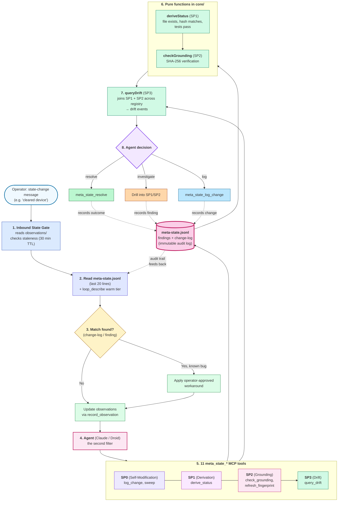

# System Architecture

## Constraint Gate System

The constraint gate system enforces operational boundaries on AI agent actions through a multi-layer gating architecture. It consists of inbound gates, outbound gates, an MCP server, and observation records.

### Architecture Diagram

```
Operator Message          Agent Action (Bash/Edit/Write)
       |                           |
       v                           v
[UserPromptSubmit]          [PreToolUse]
       |                           |
 inbound-state-gate        minimal-write-gate
       |                    bash-coordination-gate
       |                           |
       v                           v
.last-operator-message     learning-loop-mcp MCP server
       |                    (check_gate, record_observation,
       |                     update_observation, notify_artifact_change,
       |                     trigger_workflow, validate_records,
       |                     update_claim_verification, extract_index_entries,
       |                     search_index_entries, generate_capability_records,
       |                     list_runtime_probes, list_verified_claims,
       |                     gate_mark_preflight, workflow_*)
       |                           |
       +-----------+---------------+
                   |
              observations/
              (YAML records)
                   |
              .claude/coordination/
              workflows.json
              workflow-log.jsonl
```

### Inbound State Gate

**File:** `.claude/coordination/hooks/inbound-state-gate.cjs`
**Hook Type:** `UserPromptSubmit`
**Behavior:** Soft-only (never blocks)

The inbound gate intercepts operator messages before the agent processes them. It detects state-change signals (operator reporting external state changes) and injects context reminding the agent to update observations if they are stale.

#### Flow

1. Read prompt from stdin JSON (`{ prompt: string }`)
2. Skip if prompt is empty, short (`< 10` chars), or ends with `?`
3. Detect state-change signals via regex patterns
4. Write `.last-operator-message` marker file with timestamp and prompt snippet
5. Read active observations from `records/observations/`
6. Check staleness: `(now - updated_at) > 30 minutes`
7. If stale observations found, inject `additionalContext` via `hookSpecificOutput`

#### State-Change Detection Patterns

The gate uses 10 regex patterns covering:
- Device/resource clearance (`cleared`, `removed`, `wiped`, `reset`)
- Registration/creation (`registered`, `created`, `installed`, `started`)
- State reports (`working`, `running`, `fixed`, `ready`, `done`)
- Container/service state
- Slot/device status
- Operator action reports (`did`, `finished`, `completed`)
- Environment state changes
- Explicit state-change language
- Budget/resource updates
- Direct state assertions (`the X is Y`)

#### Staleness Algorithm (Inbound)

- **Threshold:** 30 minutes (`STALENESS_THRESHOLD_MS = 30 * 60 * 1000`)
- Missing `updated_at` → stale
- Invalid `updated_at` → stale
- `(now - updated_at) > 30min` → stale

#### Output Format

When stale observations are found:
```json
{
  "hookSpecificOutput": {
    "hookEventName": "UserPromptSubmit",
    "additionalContext": "INBOUND STATE GATE: ..."
  }
}
```

Always exits with code 0 (soft gate).

### Outbound Gates

**Files:**
- `.claude/coordination/hooks/bash-coordination-gate.cjs` (wrapper → `tools/learning-loop-mcp/hooks/bash-gate.js`)
- `.claude/coordination/hooks/write-coordination-gate.cjs` (wrapper → `tools/learning-loop-mcp/hooks/write-gate.js`)
- `.factory/coordination/hooks/bash-coordination-gate.cjs` (wrapper → `tools/learning-loop-mcp/hooks/bash-gate.js`)
- `.factory/coordination/hooks/write-coordination-gate.cjs` (wrapper → `tools/learning-loop-mcp/hooks/write-gate.js`)
**Hook Type:** `PreToolUse`
**Behavior:** Hard-blocking (exits 2 on escalation/block)

Outbound gates intercept agent tool usage before execution. Both Claude Code and Droid CLI use the same universal hook scripts in `tools/learning-loop-mcp/hooks/`. The bash gate checks commands against constraint patterns, budgets, observation staleness, and file writes to `records/**`. The write gate enforces hard blocks and embeds artifact-aware policy logic directly for product-build plans and product code writes.

#### Bash Coordination Gate Flow

1. Read tool input from stdin JSON
2. Skip if tool is not `Bash`
3. Match command against constraint patterns
4. Detect file writes to `records/**` via redirects (`>`, `>>`), heredocs (`<<`), and `tee`
5. Check resource budgets (global)
6. Check for active observation matching constraint or write-path
7. Check observation staleness relative to last operator message
8. Escalate, block, or allow

#### Write Coordination Gate Flow

1. Read tool input from stdin JSON
2. Skip if tool is not `Edit` or `Write`
3. Hard block unconditionally:
   - `records/observations/**`
   - `schemas/**`
   - `node_modules/**`
   - `dist/**`
   - `build/**`
   - Unknown paths (`**` catch-all)
4. Artifact-aware checks (always block regardless of `GATE_RESPONSE_MODE`):
   - `plans/**/plan.md` with `tags: [product-build]`: parse frontmatter, extract surfaces, verify decision records exist in `records/<surface>/decisions/*.yaml`; missing → block (exit 2)
   - `product/**`: infer surface from path, verify decision records exist; missing → block (exit 2)
5. For `records/evidence/**` and `records/*/evidence/**`, check for active `write-path` observation
6. If observation found, check staleness relative to last operator message
7. Fresh observation → allow; stale → escalate; none → block
8. Allow pre-authorized paths: `docs/**`, `plans/**`, `tools/**`, `.claude/**`
9. `docs/journals/**` is allowed unconditionally

Non-artifact policy decisions (budget checks, non-critical paths) are handled via the MCP server. Agents call `check_gate` via MCP for those decisions. Artifact-aware checks are enforced mechanically in the hook and cannot be bypassed.

**Rollback:** To restore the full policy hook, run:
```bash
cp .claude/coordination/hooks/write-coordination-gate.cjs.bak .claude/coordination/hooks/write-coordination-gate.cjs
```

#### Write-Path Observations

A `write-path` observation unlocks writes to otherwise blocked `records/**` paths:

- `constraint_type`: `write-path`
- `constraint`: `records-evidence` (unblocks `records/evidence/**` and `records/*/evidence/**`)

The bash gate detects file writes via shell patterns and requires a matching `write-path` observation for `records/evidence/**` or `records/*/evidence/**`. The write gate checks `write-path` observations before applying hard blocks. Both gates reuse the same staleness algorithm.

#### Staleness Algorithm (Outbound)

- **Comparison:** marker timestamp > observation updated_at
- No marker → not stale
- Missing `updated_at` → stale
- Invalid timestamps → not stale (fail-open)
- Marker newer than observation → stale

This algorithm differs from the inbound gate's 30-minute threshold. See Known Issues (F2).

### Constraint Gate MCP Server

**File:** `tools/learning-loop-mcp/server.js`
**Transport:** stdio (MCP protocol)
**Tools:** 35 tools total — `check_gate`, `record_observation`, `update_observation`, `notify_artifact_change`, `trigger_workflow`, `validate_records`, `update_claim_verification`, `extract_index_entries`, `search_index_entries`, `generate_capability_records`, `list_runtime_probes`, `list_verified_claims`, `gate_mark_preflight`, plus 13 workflow tools (`workflow_*`).

The MCP server provides the same gating logic as the outbound hooks but via the MCP protocol. All policy logic lives in `tools/learning-loop-mcp/core/` — single source of truth for both Claude Code and Droid CLI.

#### check_gate

Returns `ok`, `block`, or `escalate` for a given command. Includes `inbound_gate: true` when observations are stale relative to the last operator message.

#### record_observation

Records a new constraint observation as a YAML file in `records/observations/`.

#### update_observation

Updates an existing observation in `records/observations/` by rewriting the YAML file with new field values.

#### notify_artifact_change

Logs an artifact change to `gate-log.jsonl`, checks observation staleness, and triggers matching workflows from the workflow registry.

#### trigger_workflow

Validates a command against an allowlist and spawns it with isolated stdio. Only `node` with a script path under `tools/` is permitted.

#### validate_records

Validates YAML records under `records/` against JSON schemas. Returns structured errors, warnings, and derived assurance failures. Use after writing records to verify correctness.

#### update_claim_verification

Updates a frozen-legacy claim's verification status for a specific dimension (`static`, `install`, `runtime`, `product`). Supports preview mode (`apply: false`) before committing.

#### extract_index_entries

Extracts machine-readable index entries from evidence markdown `## Findings` sections. Idempotent — safe to call multiple times. Use after writing evidence to update the index.

#### search_index_entries

Read-only search across index entries by capability, dimension, and status. Returns matching entries with frontmatter.

#### generate_capability_records

Generates capability records from product surface adapters. Supports `dry_run` to preview drift before writing.

#### list_runtime_probes

Lists runtime probe files for a given stack. Read-only discovery tool.

#### list_verified_claims

Lists all verified claims and their supporting evidence. Read-only reporting tool. Pure JS implementation with no external dependencies.

### MCP Workflow Layer

The workflow layer auto-triggers commands when artifacts change.

#### notify_artifact_change(path, change_type)

When an agent writes an evidence file, it calls `notify_artifact_change` via MCP. The tool:

1. Appends a structured log entry to `.claude/coordination/gate-log.jsonl`
2. Reads `.claude/coordination/workflows.json` to find matching workflows
3. Checks if the artifact path and change type match any trigger rules
4. Spawns each matching command via `trigger_workflow`

#### Workflow Registry

`.claude/coordination/workflows.json` maps artifact changes to tool invocations:

```json
{
  "workflows": {
    "evidence-changed": {
      "triggers": ["records/*/evidence/**"],
      "change_types": ["created", "updated"],
      "commands": [
        ["node", "tools/extract-index-cli.js"],
        ["node", "tools/validate-records-cli.js"]
      ]
    }
  }
}
```

- Commands are arrays (e.g., `["node", "tools/extract-index-cli.js"]`)
- Allowlist: only `node` with script path under `tools/` is permitted
- Spawn isolation: `{ stdio: "pipe", detached: true }` — no inherited stdout
- All CLI scripts are thin MCP stdio shims that delegate to the MCP server

#### Workflow Logs

- **Execution log:** `.claude/coordination/workflow-log.jsonl`
- **Failure marker:** `.claude/coordination/.workflow-failures`

Workflows run async (fire-and-forget). The agent continues immediately after triggering. Check `workflow-log.jsonl` for success/failure entries and `.workflow-failures` for failure markers.

### Log Rotation

`gate-log.jsonl` rotates at 10 MB, keeping 5 backups. Older backups are deleted automatically.

### Observation Records

**Directory:** `records/observations/`
**Format:** YAML files with fields:
- `id`: Unique identifier
- `constraint_type`: Type of constraint (e.g., `docker`, `sudo`)
- `constraint`: Slug describing the constraint
- `status`: `active` or `archived`
- `updated_at`: ISO 8601 timestamp
- `description`: Human-readable explanation

Observations are the single source of truth for constraint state. The agent must not assume external state matches observation records.

### Environment Variables for Testing

| Variable | Purpose |
|----------|---------|
| `GATE_ROOT` | Override project root for observation lookup |
| `GATE_MARKER_PATH` | Override path for `.last-operator-message` marker |

### Known Issues and Limitations

#### F1: Phantom Escalation — RESOLVED

The inbound gate writes the marker file **before** checking staleness. If observations are fresh, the marker is still written. This causes the outbound gate to escalate on the next constrained command even though the inbound gate did not warn.

**Impact:** Operator sends state-change message when observations are fresh → next constrained command escalates.
**Resolution (2026-05-17):** Marker write moved after staleness check in `inbound-state-gate.cjs`. Marker is only written when observations are actually stale. Verified by integration tests.

#### F2: Staleness Algorithm Divergence — RESOLVED

The inbound gate uses a **30-minute time-based threshold**. The outbound gates use **marker-vs-observation comparison** (no threshold). These can disagree:

| Scenario | Inbound (30min) | Outbound (marker>obs) |
|----------|----------------|----------------------|
| Obs 10min old, new marker | Fresh → no warning | Stale → escalate |
| Obs 3hr old, marker 24hr old | Stale → warn | Fresh → no escalate |

**Impact:** Inbound and outbound gates may make different staleness decisions.
**Resolution (2026-05-17):** Resolved as side effect of F1 fix. Since markers are only written when observations are stale (by the 30-minute threshold), a marker exists only when observations are genuinely old. The outbound gate's `markerTime > obsTime` comparison then naturally agrees with the inbound gate's assessment. No separate fix needed.

#### F3: MCP Server Staleness Check Only on `ok` — RESOLVED

The MCP server only runs `checkObservationStaleness` when `decision === "ok"`. If budget is exhausted (decision already `escalate`), the staleness check is skipped and `inbound_gate: true` is not included.

**Impact:** Budget escalation responses don't include `inbound_gate` flag.
**Resolution (2026-05-17):** Removed `decision === "ok"` guard in `server.js`. Staleness check now runs for all constraint-matched commands regardless of decision. `inbound_gate: true` is added to budget escalations when observations are stale. Existing `ok→escalate` upgrade behavior preserved.

#### F4: Data Leak Risk

The marker file stores the first 200 characters of the operator's prompt in plaintext.

**Impact:** Sensitive information in operator messages may be persisted to disk.
**Mitigation:** Store boolean flag or hash instead of raw prompt content.

#### F8: Marker TTL — RESOLVED

The marker file never expires. An operator's state-change message causes permanent escalation until the observation is manually updated.

**Impact:** Stale marker causes escalations long after the state change is irrelevant.
**Resolution (2026-05-17):** Added `MARKER_TTL_MS = 30 * 60 * 1000` (30 minutes) to `readLastOperatorMessage` in both `gate-utils.cjs` and `server.js`. Markers older than 30 minutes are treated as `null`, preventing perpetual escalation. TTL matches inbound gate's `STALENESS_THRESHOLD_MS` for consistency.

#### F11: False Positive Rate

State-change patterns are broad. Messages like "the build is broken" trigger detection even though they may not indicate an actionable state change.

**Impact:** Occasional unnecessary context injection.
**Mitigation:** Questions ending with `?` are already filtered. Further refinement of patterns may be needed.

#### F12: Race Condition — RESOLVED

`fs.writeFileSync` is non-atomic. A partial read during concurrent write causes `JSON.parse` to fail, resulting in `readLastOperatorMessage` returning `null` and the escalation being silently skipped.

**Impact:** Rare missed escalation during concurrent marker writes.
**Resolution (2026-05-21):** Replaced `fs.writeFileSync` with atomic write (write to temp + rename) in `inbound-state-gate.cjs`. No more partial read / JSON.parse failure.

#### Multi-Session Isolation

The marker file has no session ID. Multiple Claude Code sessions sharing a project directory share the same marker file.

**Impact:** Session A's state-change message affects Session B's outbound gate.
**Mitigation:** Add session ID to marker filename.

## Meta-State Self-Learning Loop

The loop is now self-referential: the loop's own state machine (`meta-state.jsonl`) controls the loop's own audit trail. The agent can record its own modifications, derive the effective status of any finding, ground findings against the live filesystem, and (in SP3) query drift between asserted and derived state across the entire registry.

### Meta-State Tools (11 total)

The meta-state machinery is decomposed into 4 sub-projects, each adding tools to the MCP server. All 11 tools are agent-callable (read-side; some are agent-writable for new entries).

| Sub-project | Status | Tools | Purpose |
|---|---|---|---|
| **SP0 (Self-Modification Affordance)** | SHIPPED (475 tests) | `meta_state_log_change`, `meta_state_sweep` | Agent logs its own system changes as first-class change-log entries |
| **SP1 (Derivation Query)** | SHIPPED (511 tests) | `meta_state_derive_status` | Pure-function verifier: "is this finding's mechanism still live?" (file exists, hash matches, tests pass) |
| **SP2 (Grounding Check)** | SHIPPED (552 tests) | `meta_state_check_grounding`, `meta_state_refresh_fingerprint` | Pure-function grounding + explicit recovery: hash-mismatch detection + fingerprint refresh on legitimate code change |
| **SP2 gap closure** | SHIPPED (557 tests) | (no new tools) | `loop_describe` warm-tier surfacing + `agent-manifest.json` backfill |
| **SP3 (Drift Query)** | SHIPPED (674 tests) | `meta_state_query_drift` | Read-only drift aggregation: joins SP1 + SP2 across the registry to surface entries where asserted status disagrees with derived/grounded state |
| **Original 5 (260602-self-enforcing-loop)** | SHIPPED (407 tests) | `meta_state_report`, `meta_state_list`, `meta_state_ack`, `meta_state_resolve`, `meta_state_promote_rule` | Foundational CRUD + rule promotion |

**Total: 11 tools in the `meta_state` group of `agent-manifest.json`.** Baseline after SP2 gap closure: 557 tests; after SP3 ships: 674 tests.

### Self-Learning Loop Architecture



**Diagram legend:**

| Visual | Meaning |
|---|---|
| Stadium shape (rounded ends) | External trigger (operator, environment) |
| Rectangle | Step or component in the loop |
| Cylinder | Registry / single source of truth (`meta-state.jsonl`) |
| Rhombus | Decision point |
| Solid arrow | Synchronous flow (this step happens next) |
| Dashed arrow | Optional / async flow |
| Pink fill, thick border | The registry (single source of truth) |
| Green fill | Pure function (no side effects) |

**Key properties:**

- **Self-aware audit trail**: The agent uses `meta_state_log_change` to record any system modification (schema change, tool addition, gate rule promotion, etc.) as a first-class entry. The change-log entries are immutable audit log (no TTL, no auto-resolve).
- **Verifiable assertions**: For any finding, the agent can call `meta_state_derive_status` to compute the effective status from the live filesystem (without mutating the entry). Drift between the entry's `status` and the derived `derived_status` is surfaced via `drift: true`.
- **Grounded claims**: For findings with `mechanism_check: true`, the agent can call `meta_state_check_grounding` to verify the file is still live, the SHA-256 hash matches the last check, and (optionally) the referenced tests still pass. Drift is detected via `status: "drifted"`.
- **Aggregate drift surfacing** (SP3, shipped): `meta_state_query_drift` joins SP1's `derived_status` + SP2's `grounding.status` across the entire registry, returning a flat list of drift events with `recommendation` (resolve / investigate). Default `run_grounding: false` (derivation-only); opt-in to join SP2. Phase 2 (auto-mutation) is captured as a stub for a follow-up brainstorm after 30 days of drift-rate data.
- **Schema-as-source-of-truth** (Approach 2, shipped): The 4 record types (experiment, risk, decision, observation) now derive their tool zod schemas from JSON Schema at runtime via `core/schema-to-zod.js`. This is orthogonal to the meta-state work but the meta-state tools benefit from the field-coverage test that catches drift between schema and tool surface. Approach 3 (full codegen for writers + validators) is sequenced after SP3 per `docs/trajectory.md`.

### Relationship to the Constraint Gate

The constraint gate (`core/gate-logic.js`) and the meta-state registry are **separate** but **complementary**:

- The **gate** enforces *observation existence* (pattern matched → observation present? → pass/block). It does NOT track budget exhaustion, fingerprint matching, or other domain state. The gate is the first filter.
- The **meta-state** records the *agent's reasoning* (e.g., "I checked the budget and it was safe because the fingerprint matched"). It is the audit trail. The agent is the second filter.
- See `docs/observation-vs-meta-state.md` for the full layer separation.

### References

- `plans/reports/brainstorm-260602-meta-state-agent-affordances.md` — parent doc, the 4-sub-project decomposition
- `plans/reports/brainstorm-260603-sp3-drift.md` — SP3 design (status: locked 2026-06-05)
- `plans/260603-sp3-drift/plan.md` — SP3 plan (status: completed, 4-phase TDD + Phase 4 docs update, 11h total)
- `docs/observation-vs-meta-state.md` — domain/meta/gate layer separation
- `docs/trajectory.md` — long-term direction, the four bridges, the fifth bridge (schema as source of truth)
